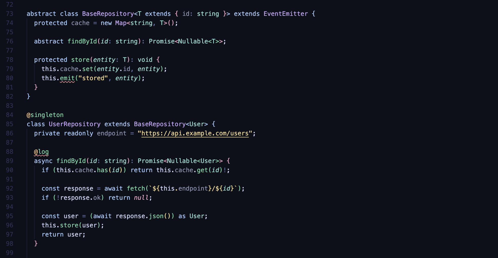
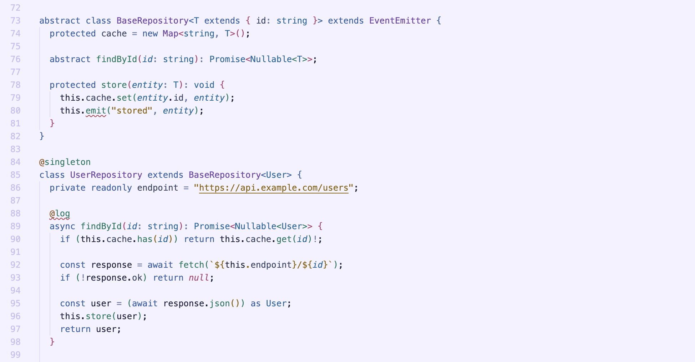

# Aurora Drift Theme

A VS Code theme inspired by the aurora borealis — available in dark and light variants.

&nbsp;

## Themes

**Aurora Drift Dark** — deep midnight blues with aurora accent colors  
**Aurora Drift Light** — soft lavender whites with rich, saturated accents

## Color Palette

### Aurora Drift Dark

| Role | Color |
|---|---|
| Background | `#0d0f1a` |
| Foreground | `#ccd6f6` |
| Blue | `#a0c8f8` |
| Cyan | `#90ddd0` |
| Green | `#70d8a8` |
| Purple | `#c8a8f8` |
| Pink | `#f0a8c8` |
| Yellow | `#f0d890` |
| Orange | `#f5c080` |
| Red | `#f09898` |

### Aurora Drift Light

| Role | Color |
|---|---|
| Background | `#f4f2ff` |
| Foreground | `#1e2240` |
| Blue | `#3060a8` |
| Cyan | `#1068a0` |
| Green | `#007a62` |
| Purple | `#7048a8` |
| Pink | `#b04878` |
| Yellow | `#8a6500` |
| Orange | `#905820` |
| Red | `#b04858` |

## Installation

1. Open VS Code
2. Go to Extensions (`Ctrl+Shift+X` / `Cmd+Shift+X`)
3. Search for **Aurora Drift Theme**
4. Click **Install**
5. Open the Command Palette (`Ctrl+Shift+P` / `Cmd+Shift+P`) → **Preferences: Color Theme** → select **Aurora Drift Dark** or **Aurora Drift Light**

## Repository

[github.com/anamariafovo/vscode-aurora-drift-theme](https://github.com/anamariafovo/vscode-aurora-drift-theme)
